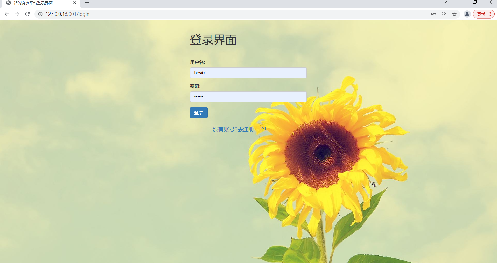
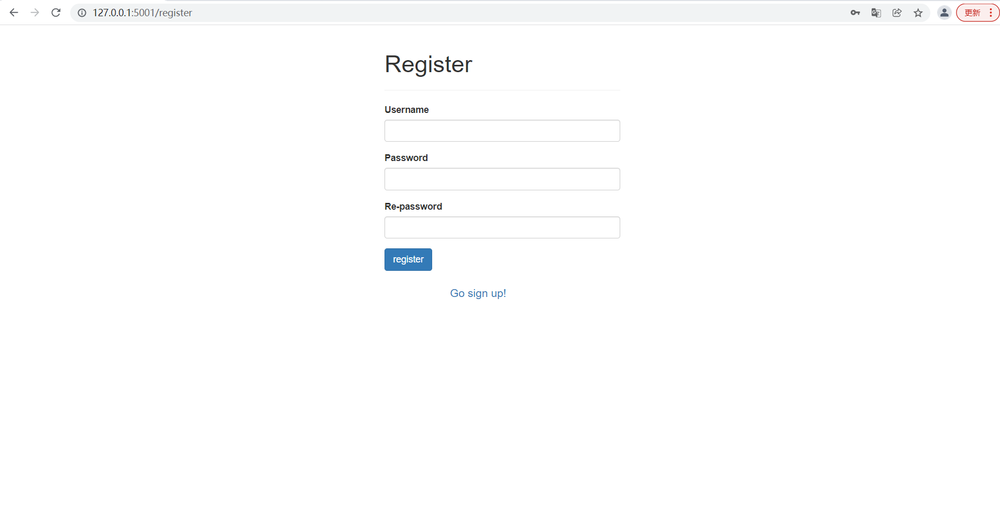
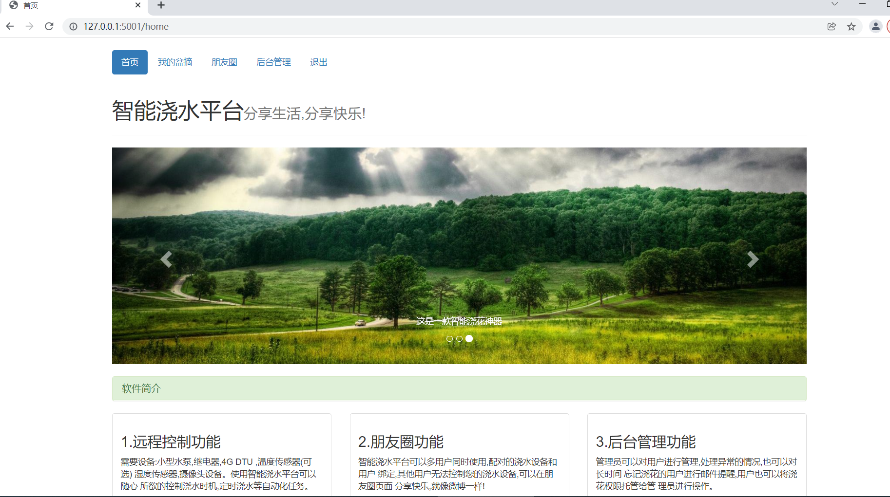
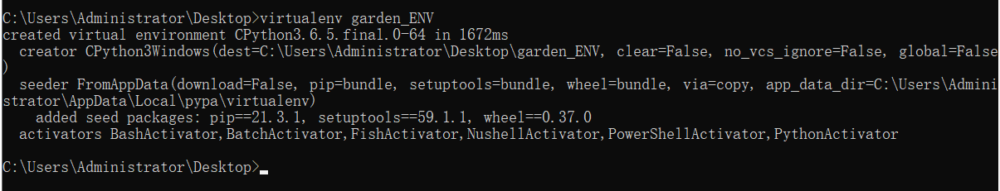
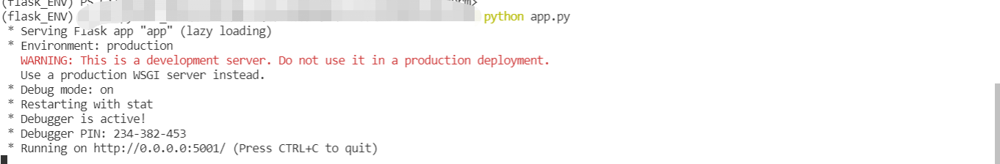

# Python Flask 书本管理应用

## 1.界面展示

### （1）登录界面

###   (2) 注册用户界面

### （3） 普通用户书本查询下载界面

### （4）管理员用户管理界面

### （5）管理员书本管理界面

### （6）管理员权限管理界面

​	

### 	

## 2.环境配置

### （1）安装Python环境

​	windows下：

​			下载Python3.6以上版本（python.org）

​	Linux(centos8)：

​			自带python3.6.8

### （2） 安装虚拟环境并安装依赖包

​	windows下：

​			安装virtualenv模块 ：pip install virtualenv

​			创建虚拟环境文件夹：cmd中输入： virtualenv flask_ENV(需要创建的虚拟环境文件夹名称)

​			激活虚拟环境: 在cmd中进入flask_ENV\Scripts目录，输入：activate即可激活虚拟环境，退出虚拟环境: deactivate

​			安装依赖包：激活虚拟环境后cd 进入项目目录，里面有一个requirements.txt依赖文件，安装只需要使用：pip install -r requirements.txt即可自动安装所有的依赖包。

Linux下：

​			创建虚拟环境：virtualenv -p python3.6 flask_ENV

​			激活虚拟环境: source flask_ENV/bin/activate

​			除了上述步骤与windows不一样以外其他步骤均相同。

### （3）创建表结构

不需要手动创建对应的数据库（使用的是sqlite3）

在项目代码中的app.py中将下面的代码运行即可自动创建表结构.

## 3. 运行web应用程序

进入虚拟环境后：python app.py 即可运行该应用程序。目前写好的功能有：用户登录，用户注册，书本下载，书本查询，书本筛选，批量导入用户等等

