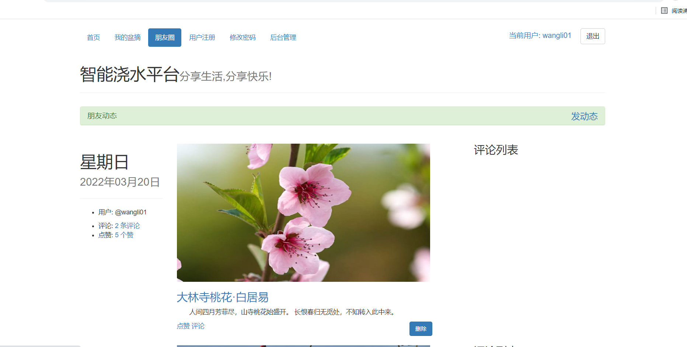

# Python +Flask + mysql 智能浇水平台

## 1.界面截图

### （1）登录界面

###   (2) 注册用户界面

### （3）修改密码页面

### （4） 用户主页

### （5）我的盆摘页面

### (6）朋友圈页面

### （7）管理员后台管理界面权限表

### 	（8）管理员后台管理用户表

​			

###       (9) 管理员后台管理用户组表

### （10）管理员后台管理设备表

### （11）管理员后台管理朋友圈动态表

### （12）管理员后台管理朋友圈动态评论表

### （13）管理员后台管理朋友圈点赞信息表

## 2.环境配置

### （1）安装Python环境

​	windows下：

​			下载Python3.6以上版本(python.org)

​	Linux(centos7.2)：

​			yum install python3

​	

### （2） 安装虚拟环境并安装依赖包

​	windows下：

​			安装virtualenv模块 ：pip install virtualenv

​			创建虚拟环境文件夹：cmd中输入： virtualenv garden_ENV(需要创建的虚拟环境文件夹名称)

​			激活虚拟环境: 在cmd中进入flask_ENV\Scripts目录，输入：activate即可激活虚拟环境，退出虚拟环境: deactivate

​			安装依赖包：激活虚拟环境后cd 进入项目目录，里面有一个requirements.txt依赖文件，安装只需要使用：pip install -r requirements.txt即可自动安装所有的依赖包。

Linux下：

​			创建虚拟环境：virtualenv -p python3.6 garden_ENV  或 virtualenv garden_ENV

​			激活虚拟环境: source garden_ENV/bin/activate

​			除了上述步骤与windows不一样以外其他步骤均相同。

### （3）创建表结构

使用的数据库为:Mysql  

首先需要启用mysql服务: windows :net start mysql   linux: service mysql start

在项目代码中的app.py中将下面的代码运行即可自动创建表结构.

## 3. 运行web应用程序

在权限表中导入权限数据：

权限数据在：database文件夹中(permission.sql,permissions.xlsx)

执行sql脚本或者在网页的后台管理权限表中批量导入。

进入虚拟环境后：python app.py 即可运行该应用程序。

## 4. 使用nginx + gunicorn 部署

### （1）nginx的配置

####         安装nginx ：yum install nginx

​		（1）安装完成后查看nginx版本：nginx -v

​         （2）在/etc/nginx/nginx.conf中修改配置：vim /etc/nginx/nginx.conf    注：server中的端口为nginx的监听端口， location中的地址为gunicorn 运行flask app服务的地址,如:127.0.0.1:5001 ,下面两个location为配置的静态资源地址。如果出现加载静态资源报403的情况，需要把nginx中的配置：user nginx; 改为：user root; 修改完成后按esc 冒号 输入：wq 保存退出vim。

​             (3) 重启nginx : nginx -s reload  查看nginx的服务 ：lsof -i:5000 查看到对应的进程即为配置成功 。运行nginx命令：nginx

### （2）使用gunicorn 运行服务

​			（1）安装gunicorn 包:pip install gunicorn 

​			（2）使用gunicorn 运行flask项目：进入虚拟环境，项目目录，执行: gunicorn -w 4  -b 127.0.0.1:5001 app:app  & (-w 为进程数,-b 为绑定的host:port   ， &表示后台运行)

### （3）测试结果

​              访问网页并查看接口的server是否为nginx，查看到Server: nginx/1.20.2表示部署成功

